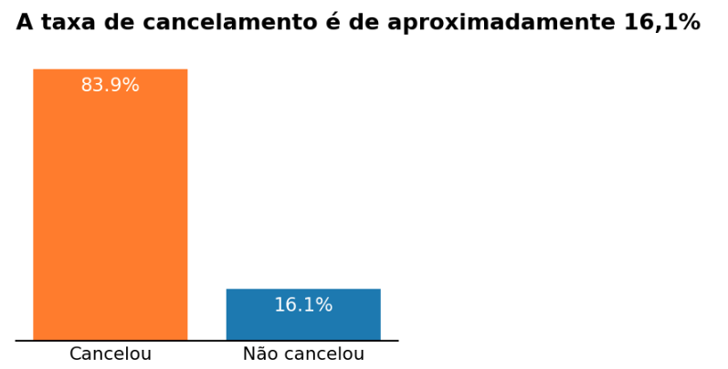
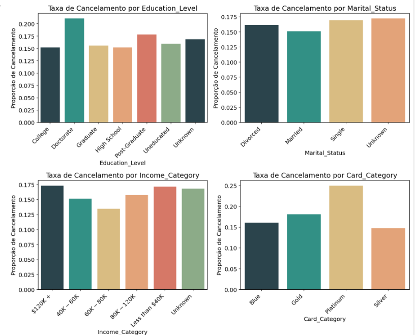
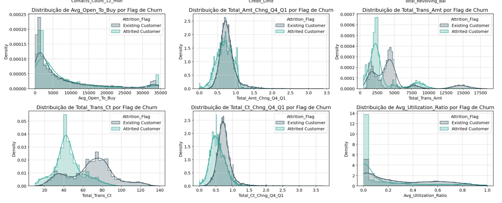
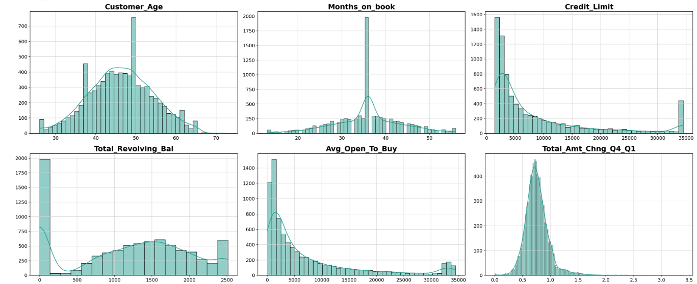
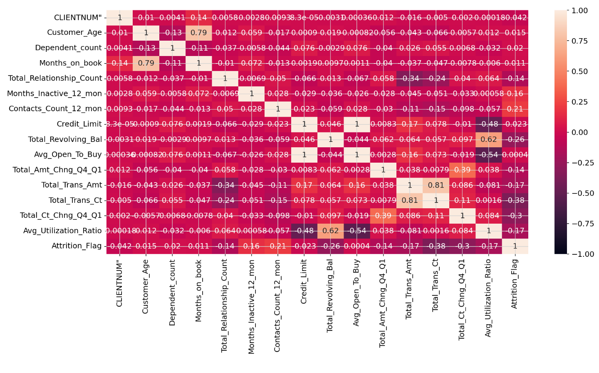
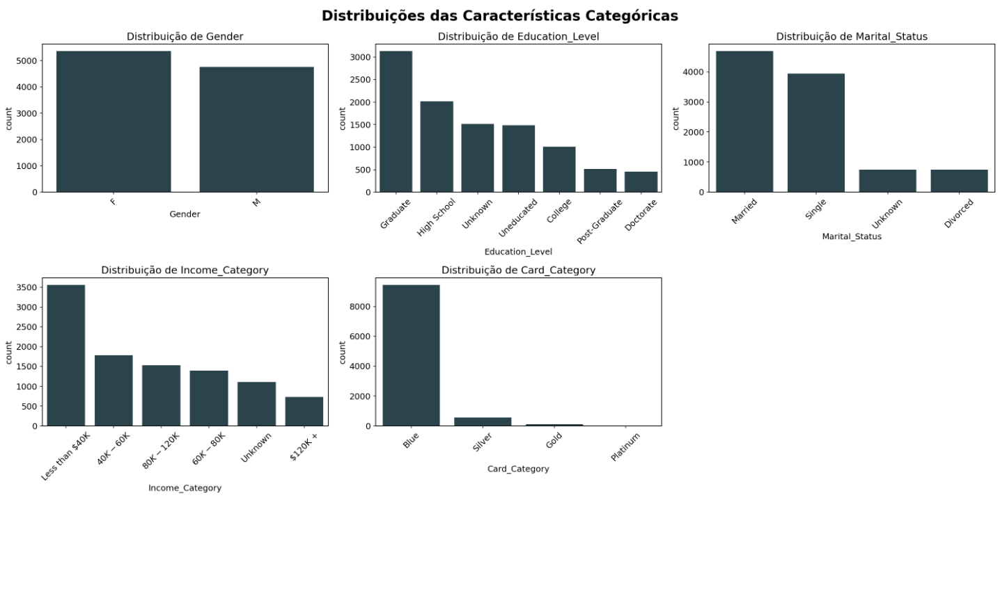
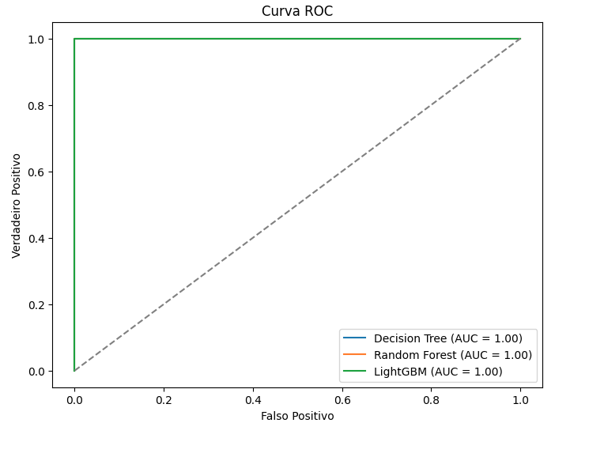
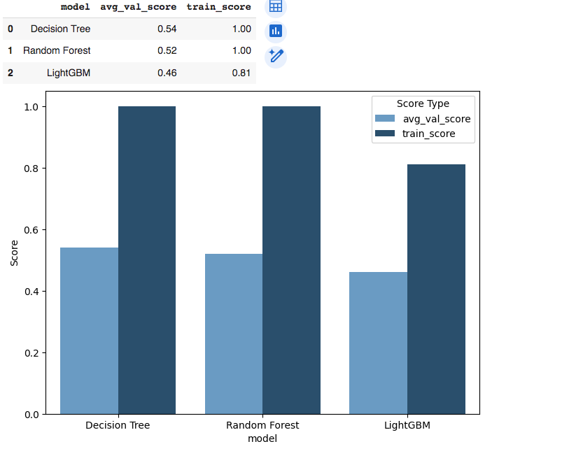
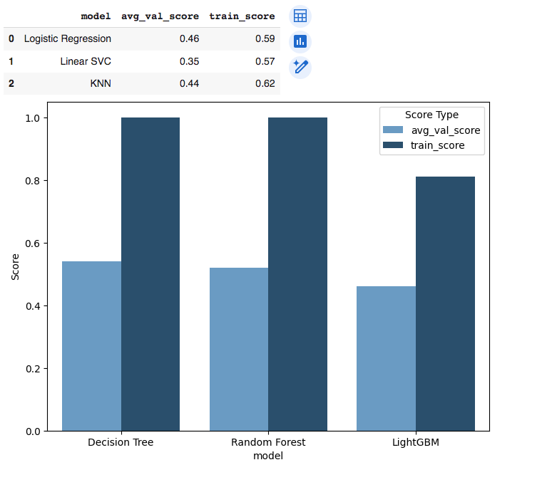
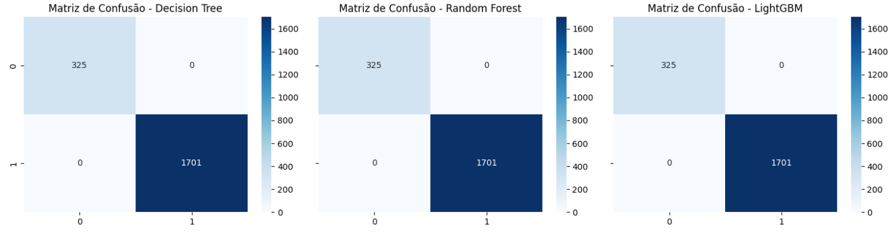

# **Bank's Credit Card Service Churn Prediction**

<p align="center">  </p>

# **1. Descrição**

## **📊 Sobre o Projeto**
Este projeto busca desenvolver um modelo preditivo para antecipar o risco de cancelamento de cartões de crédito, utilizando Machine Learning para identificar padrões nos dados históricos dos clientes. A análise considera informações como comportamento de compra, pagamentos e histórico de crédito, ajudando bancos a melhorar suas estratégias de retenção.

# **2. Tecnologias e ferramentas**
O projeto foi desenvolvido em **Python**, utilizando **Pandas** e **NumPy** para manipulação de dados, **Matplotlib** e **Seaborn** para visualização, e **Scikit-Learn** junto com **XGBoost** para modelagem preditiva. O ambiente de desenvolvimento escolhido foi o **Google Colab**, permitindo fácil execução dos notebooks. Além disso, o código foi versionado e armazenado no **GitHub**, garantindo organização e colaboração no projeto.

# **3. Problema de Negócio e objetivo do projeto**

### **3.1 Qual o problema de negócio?**
O gerente do banco está incomodado com o fato de cada vez mais clientes abandonarem os serviços de cartão de crédito. Eles realmente apreciariam se alguém pudesse prever para eles a probabilidade de um cliente se desligar, para que possam proativamente ir até os clientes para fornecer-lhes melhores serviços e direcionar suas decisões na direção oposta.

### **3.2 Qual o contexto?**
O cancelamento de cartões afeta a rentabilidade dos bancos, tornando essencial a análise de três KPIs:
- CAC (Custo de Aquisição de Cliente): Quanto menor, mais eficiente a aquisição.
- CLV (Valor Vitalício do Cliente): Mede a receita total gerada ao longo do relacionamento.
- Taxa de Churn: Percentual de clientes que cancelam seus cartões.
  
Para aumentar a rentabilidade, o banco deve minimizar o CAC e o churn enquanto maximiza o CLV. O modelo preditivo ajudará a identificar clientes em risco, permitindo ações estratégicas para retenção.

### **3.3 Qual os objetivos do projeto?**
1. Identificar os principais fatores associados ao churn de clientes.  
2. Desenvolver um modelo preditivo para estimar a probabilidade de churn.  
3. Fornecer estratégias acionáveis para reduzir o cancelamento de cartões de crédito.  

### **3.4 Quais são os benefícios do projeto?** 
- **Redução de Custos**: Diminui os gastos com aquisição de novos clientes.  
- **Melhoria na Retenção de Clientes**: Permite estratégias proativas para manter clientes em risco.  
- **Experiência do Cliente Aprimorada**: Intervenções personalizadas aumentam a satisfação.  
- **Marketing Direcionado**: Auxilia na criação de campanhas mais eficazes.  
- **Proteção de Receita**: Minimiza perdas com churn e maximiza o CLV.

### **3.5 Conclusão**
Prever a probabilidade de churn fornece insights mais úteis do que previsões binárias (1/0), permitindo que o banco entenda o risco de cancelamento de cada cliente. Isso possibilita uma alocação mais eficiente de recursos e a implementação de estratégias de retenção mais eficazes, priorizando clientes com maior probabilidade de churn.

# **4. Solution pipeline**
O pipeline seguiu o framework CRISP-DM e incluiu as seguintes etapas:

- Definição do problema de negócio
- Coleta e análise inicial dos dados
- Divisão dos dados em conjuntos de treino e teste
- Análise exploratória dos dados (EDA)
- Engenharia de features, limpeza e pré-processamento dos dados
- Treinamento, comparação, seleção de features e ajuste de modelos
- Interpretação dos resultados

# **5. Principais insights**

- O banco apresenta uma alta taxa de churn, com aproximadamente **16% dos clientes cancelando seus cartões**, o que reforça a necessidade deste projeto para identificar padrões e propor estratégias de retenção mais eficazes.
<p align="center">  </p>

- A proporção de cancelamento evidencia um desequilíbrio nos dados, o que deve ser considerado na modelagem preditiva.
<p align="center">  </p>

- A distribuição da variável de churn mostra diferenças significativas entre clientes ativos e cancelados.
<p align="center">  </p>

- A análise exploratória revelou que clientes com menor frequência de transações e baixo gasto médio apresentam maior probabilidade de churn.
<p align="center">  </p>

- Atrasos em pagamentos e altos valores de fatura estão fortemente correlacionados com o cancelamento do cartão. Clientes com menor tempo de relacionamento com o banco tendem a cancelar o cartão com mais frequência, indicando a importância de estratégias de engajamento nos primeiros meses.
A análise de correlação entre as variáveis reforça a influência de determinados fatores no churn.
<p align="center">  </p>

- Fatores como idade e tipo de cartão também influenciam a taxa de churn, sendo que clientes mais jovens e usuários de cartões básicos apresentam maior propensão ao cancelamento.
<p align="center">  </p>

- O modelo preditivo alcançou alta acurácia e poder discriminativo, permitindo ao banco priorizar clientes com alto risco de churn e direcionar ações personalizadas.
A avaliação do modelo foi realizada com Curva ROC e comparação entre diferentes abordagens (modelos lineares e baseados em árvores).
<p align="center">  </p> 


# **6. Modelagem**  

Claro! Aqui está o resumo com as imagens colocadas no momento em que são citadas:

### **6. Modelagem**  

- Foram criados **dois pré-processadores**: um para **modelos lineares** e outro para **modelos baseados em árvores**.  
  - Para modelos lineares: **one-hot encoding** para variáveis categóricas e **padronização (Standard Scaling)** para variáveis numéricas.  
  <p align="center">  </p>  
  
  - Para modelos baseados em árvores: **ordinal encoding** para variáveis ordinais e **target encoding** para as outras variáveis categóricas. Variáveis numéricas foram mantidas sem transformação.  
  <p align="center">  </p>  
  
  - Engenharia de features, incluindo **média de transações**, **proporção de meses inativos** e **gasto total**, foi realizada antes do pré-processamento.  

- Todo o pipeline foi estruturado em **transformers no scikit-learn**, facilitando a **implantação em produção**.  

- **Validação e comparação de modelos** foi feita com **validação cruzada estratificada (stratified k-fold)**, focando no **ROC-AUC** devido ao desbalanceamento dos dados.  
  <p align="center">  </p>  

 # **7. Resultados Financeiros**  

Para avaliar se o projeto é viável financeiramente, foi estimado um **resultado financeiro base**. Embora não tenha sido possível acessar dados específicos para calcular o ganho exato, uma fonte comum de receita para as empresas de cartões de crédito é a cobrança de taxas sobre o saldo devedor, também conhecido como **total revolving balance**, que os portadores de cartão carregam de mês a mês. 

Assumindo uma taxa de **18%** (valor comum) sobre o saldo devedor, o cálculo foi feito da seguinte forma:

- **Ganho verdadeiro positivo**: 10% de taxa sobre os saldos devedores como uma estratégia de retenção.
- **Custo de retenção de falsos positivos**: Desconto de 8% dado sobre os saldos devedores.
- **Custo de falsos negativos (clientes que cancelaram)**: O custo total da taxa de 18% que teria sido recebida se o cliente não tivesse cancelado.

A partir dessa estimativa, foi possível alcançar um **ganho estimado de $171,477**, um resultado excelente!

Com isso, o projeto atingiu seu objetivo, permitindo ao banco acessar as **probabilidades de churn dos clientes**, facilitando decisões mais informadas. Esse processo fortalece os esforços estratégicos de retenção e melhora a tomada de decisões, solucionando, assim, o problema de negócio.

- O modelo **LightGBM** obteve o melhor desempenho médio na validação, sendo escolhido para **seleção de features**, **ajuste de hiperparâmetros** e **avaliação final**.  

- **Overfitting** foi observado, mas não foi causado por vazamento de dados, e sim pela **qualidade do conjunto de dados**. As variáveis separaram bem os clientes que cancelaram e os que não cancelaram.

# **8. Run this project on your local machine**
Aqui está o guia passo a passo para rodar o projeto na sua máquina local:

### **Pré-requisitos**  
Antes de começar, certifique-se de ter os seguintes itens instalados na sua máquina:

- **Python 3.11.4**  
- **pip** (gerenciador de pacotes do Python)  
- **Git** (ferramenta de controle de versão)

### **Passos para Rodar o Projeto**  

1. **Clone o repositório**  
   Abra o terminal e execute o seguinte comando para clonar o repositório do projeto:
   ```bash
   git clone https://github.com/giuliabugatti09/bank_credit_card_churn_predicition.git
   ```

2. **Navegue até o diretório do repositório clonado**  
   Após clonar o repositório, navegue até a pasta do projeto:
   ```bash
   cd bank_credit_card_churn_predicition
   ```

3. **Crie um ambiente virtual**  
   Crie um ambiente virtual para gerenciar as dependências do projeto:
   ```bash
   python -m venv venv
   ```

4. **Ative o Ambiente Virtual**  
   Ative o ambiente virtual para isolar as dependências do projeto:
   - No **Windows**:
     ```bash
     venv\Scripts\activate
     ```
   - No **macOS/Linux**:
     ```bash
     source venv/bin/activate
     ```

5. **Instale as Dependências**  
   Instale todas as dependências necessárias listadas no arquivo `requirements.txt`:
   ```bash
   pip install -r requirements.txt
   ```

6. **Execute a Aplicação**  
   Por fim, execute a aplicação com o comando:
   ```bash
   python application.py
   ```
### Agora o aplicativo deve estar rodando na sua máquina local!

# **10. Dataset link**
The dataset was collected from kaggle.

Link: https://www.kaggle.com/datasets/sakshigoyal7/credit-card-customers?sort=votes

# **11. Contact me**
Linkedin: https://www.linkedin.com/in/giulia-bugatti-fonseca-226955267/

Github: https://github.com/giuliabugatti09

Gmail: giuliabugatti02@gmail.com
